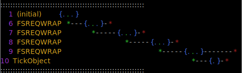

`cnysa` (unpronouncible) is a module that allows you to see information about what the `async_hooks` module is doing under the covers. `AsyncResources` and their lifecycle events are displayed neatly in rows (see bottom for examples).

# Pre-Require Hook

Pre-require `cynsa/register` in your application:

```bash
node --require cynsa/register app.js
```

If `cnysa.json` exists in the current working directory, it will be used as the configuration passed to the `Cnysa` constructor as described below.

# API

```js
const { Cnysa } = require('cnysa');
```

## `new Cnysa()`

Constructs a new `Cnysa` instance.

## `Cnysa#enable()`

Starts recording async events.

## `Cnysa#disable()`

Stops recording async events.

## `Cnysa#mark(tag?: string|number)`

Generate a special `AsyncResource` with the given tag. If `tag` is not specified, a monotonically increasing number is assigned to it.

The special `AsyncResource` will be displayed as a single event in cyan. This is good for determining the current running async resource.

## `Cnysa#createAsyncSnapshot(options: CnysaSnapshotOptions)`

* `options.width`: Maximum number of characters to print on a single line before wrapping. Defaults to the current terminal width.
* `options.ignoreTypes`: A string or RegExp to filter out `AsyncResource` types.
* `options.roots`: A list of `AsyncResource` IDs that must be an ancestor of a given `AsyncResource` for it to be displayed. The default value, an empty list, is equivalent to specifying no constraint on ancestry.
* `options.padding`: Number that represents the amount of space between each depicted event.
* `options.format`: A string that represents how the output should be formatted. Currently, the available options are `'default'` and `'svg'` (which uses [`ansi-to-svg`](https://github.com/F1LT3R/ansi-to-svg)).

Returns a formatted async ancestry tree. Great for printing in the console.

All options are optional.

## `Cnysa#createAsyncStackTrace(options: CnysaStackTraceOptions)`

* `options.ignoreTypes`: A string or RegExp to filter out `AsyncResource` types.

__Experimental.__ Returns a formatted async stack trace.

All options are optional.

## `Cnysa.get()`

Gets the most recently constructed `Cnysa` instance. If none were constructed, one is constructed automatically and returned. Therefore, this method is guaranteed to return a `Cnysa` instance.

This is useful when it is unknown whether `cnysa` has been used earlier in the application, especially as a command-line require.

# Understanding output

For each `AsyncResource`, a timeline will be printed, with a number of colored symbols:

* Green `*` represents the async resource creation.
* Red `*` represents its destruction.
* Blue `{...}` represent running in an async scope.
* Gray `-` indicates the lifetime of the resource creation, and is bookended by `*` symbols.
* Cyan `*` represents a location where `Cnysa#mark` was called.

## Examples

```bash
node --require cnysa/register -e "                 \
  fs.readFile('package.json', (err, contents) => { \
    require('cnysa').Cnysa.get().mark('hi');       \
  })"
```


