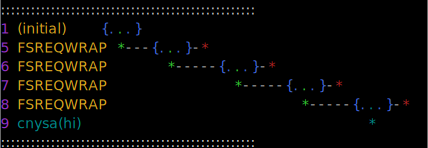

`cnysa` (unpronouncible) is a module that allows you to see information about what the `async_hooks` module is doing under the covers.

__Note: This module currently uses the `colors` module.__

# Pre-Require Hook

Pre-require `cynsa/register` in your application:

```bash
node --require cynsa/register app.js
```

If `cnysa.json` exists in the current working directory, it will be used as the configuration passed to the `Cnysa` constructor as described below.

# API

```js
const { Cnysa } = require('cnysa');
```

## `new Cnysa(options)`

All options are optional.

* `options.width`: Maximum number of characters to print on a single line before wrapping. Defaults to the current terminal width.
* `options.ignoreTypes`: A string or RegExp to filter out `AsyncResource` types.
* `options.highlightTypes`: A string or RegExp to highlight certain `AsyncResource` types and their descendants.
* `options.ignoreUnhighlighted`: Boolean to determine whether unhighlighted types should be ignored.
* `options.padding`: Number that represents the amount of space between each depicted event.
* `options.colors`: An array of strings that represent colors to use when highlighting.
* `options.format`: A string that represents how the output should be formatted. Currently, the available options are `'default'` and `'svg'` (which uses [`ansi-to-svg`](https://github.com/F1LT3R/ansi-to-svg)).

## `Cnysa#enable()`

Starts recording async events.

## `Cnysa#disable()`

Stops recording async events.

## `Cnysa#getAsyncSnapshot()`

Returns a formatted async ancestry tree.

# Understanding output

For each `AsyncResource`, a timeline will be printed, with a number of colored symbols:

* Green `*` represents the async resource creation.
* Red `*` represents its destruction.
* Blue `{...}` represent running in an async scope.
* Gray `-` indicates the lifetime of the resource creation, and is bookended by `*` symbols.

## Examples

```bash
node --require cnysa/register -e "fs.readFile('package.json', (err, contents) => { console.log('done reading') })"
```


